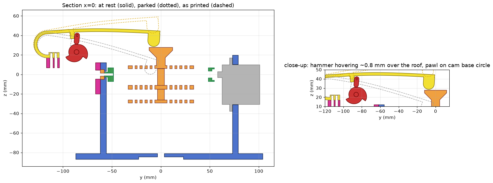

# IMU gimbal rig

Pan / tilt / roll rig that carries a whole set of Adafruit IMU, accelerometer
and magnetometer breakouts (3/6/9 DoF) at once, with a cam-driven striker for
tap and double-tap detection testing.

Target sensors: the drivers added in
[adafruit/Adafruit_Wippersnapper_Arduino#839](https://github.com/adafruit/Adafruit_Wippersnapper_Arduino/pull/839)
(ISM330DHCX, ISM330DLC, LIS2MDL, LIS3DH, LIS3MDL, LSM303AGR, LSM303DLH,
LSM6DS3, LSM6DSO32, LSM9DS1). Mostly STEMMA QT breakouts, the odd legacy board,
and one FeatherWing.

## Requirements

- Every sensor is mounted at the same time, on stacked layers of swirly-grid
  plates ([tannewt/swirly-grid](https://github.com/tannewt/swirly-grid)). The
  sides stay open, with a small roof in the middle of the top to whack on. A
  swirly-grid PCB also bolts on through the matching slots.
- Only the centre plate connects to the roll servo and axle. The other plates
  hang off it on central standoffs in line with the roof, not at the edges.
- STEMMA QT sized breakouts, 4 across, plus a Feather-sized place for one
  FeatherWing.
- Hobby servos: MG90S (roll, and an MG90S-size 270° servo for the striker
  cam) and DS3240MG (tilt and pan). Both are measured; see
  `docs/servo-measurements.png`.
- Aim for ±180° on every axis. In practice the servo travel limits it.
- Sensors do not need to sit on the rotation centre. Off-axis
  acceleration is accepted.

## Sensor stack (`make_sensor_stack.py`)

Each deck is a 5 x 4 cell swirly grid (76.2 x 61 mm) with a 3 mm border. The
sides are open.

| Deck | Boards |
|---|---|
| top | 8 portrait QT around a central post with a flared **roof** (24 mm square) for the striker |
| middle | FeatherWing on 10 mm standoffs (clears header pins) + 1 QT, and 4 QT. Its +X / -X end walls carry the MG90S roll horn and the idler axle. This is the only deck connected to the gimbal. |
| bottom | 8 portrait QT |

That is room for **21 QT boards + 1 FeatherWing**. PR 839 needs 9 breakouts + the wing.

- **Board layout:** boards sit portrait, 4 across, in two rows per deck. Each
  uses the QT connector on its outer edge, so cables leave through the open
  ±Y sides.
- **Fixing:** each board bolts through its top-edge hole pair (every QT board
  has it), with M2.5 screws, 3 mm spacers and nuts.
- **Spines:** a solid strip runs between the two rows on every deck. The upper
  and lower spines (36 x 7 mm standoffs) sit on it, directly under the roof.
- **Clamping:** two M3 bolts at x = ±14 run through the whole stack, with the
  heads on top, just outside the roof, and nuts underneath.
- **Mux:** you'll need a TCA9548A, because of I²C address clashes (several
  LIS3MDL/LSM303/LSM9DS1 parts share addresses). It fits in a spare board spot.

`pack_faces.py` checks the board placements against the slot geometry.

## Tap striker (`make_striker.py`)

A PETG flat bar with a single hairpin curve at its base. A 270° servo lifts it
with a cam, and the bar drops onto the roof.

- **Preload is printed in.** The bar is printed in its free shape, with the
  hammer tip about 30 mm below the roof. Screw the pad down from under the
  stand (2 x M3). Without the cam, the hammer would press on the roof with
  **2 N**. Bend the bar up to fit the cam.
- **Hovers at rest:** the cam's base circle holds the pawl, so the hammer sits
  **~0.8 mm above the roof** (`HOVER` sets this), even with the servo
  unpowered. The cam carries about 10 N at rest. The pawl leans 8° into its
  stop, so that load holds it there.
- **Lift and release:** the cam lifts a pinned pawl under the bar. At the
  cliff, the pawl drops off and lands on the base circle. The hammer's
  momentum flexes the arm on through the hover gap into the roof, then it
  springs back to hover (piano-style let-off). The drop releases about 36 mJ.
  The arm could overshoot by about 14 mm, far more than the gap, so the tap
  always lands.
- **Reset:** a 270° servo has to turn back to re-arm. On the reverse stroke the
  pawl folds away from the cliffs, then gravity drops it back against its stop.
- **Two lobes in the 270° travel:**

  | Action | Servo |
  |---|---|
  | rest, hammer hovering | 0° |
  | park for a double tap | ~120° |
  | park for a single tap | ~240° |
  | double tap | sweep forward through 125° and 245°. The tap spacing is set by sweep speed: about 0.2 s at full MG90S speed, longer if you sweep slower. |
  | single tap | from 240°, step past 245° |
  | re-arm | back to 0°, then forward to a park angle |

  **Keep the hammer parked whenever the gimbal moves.**
- **Computed for E = 2 GPa:**
  - bar 16 x 3.0 mm, 116 mm reach, 12 mm hairpin
  - cam force 10 N at rest and 14 N when parked, cam lift 4.2 mm
  - servo torque about 0.35 kg·cm
  - peak strain 1.3 % when parked
- **Creep:** PETG relaxes under the constant rest load. The hover gap holds
  (the cam fixes the shape), but strike energy may fall a little over weeks.
- **Tuning:** force goes as thickness cubed. `BAR_T`, `F0` and `TRAVEL` are at
  the top of `make_striker.py`. A wedge shim under the pad also trims the
  preload.
- **Mounting:** the stand bolts to the outer face of the pan yoke's idler
  upright (4 x M3) and covers the tilt bearing.
- **Range with the striker fitted (hammer parked):** roll ±90° is clear, and
  tilt is limited to **±55°**.
- **Printing:** print `striker_bar` on its side, so the layers follow the bend.
  The pawl pin is a length of 1.75 mm filament.



## Gimbal (`make_gimbal.py`)

Axes: roll = X, tilt = Y, pan = Z, all crossing in the stack. The script
measures the sweep radius of each stage to size the next one out. It then
rotates each stage through 360° against its neighbour, checks the striker
against the roll and tilt ranges, and reports any collision.

| Part | Holds | Servo | Idler |
|---|---|---|---|
| `stack_*` | all the boards | MG90S horn pocket on the middle deck's +X wall | M3 axle boss on the -X wall |
| `tilt_ring_mg90s` | roll servo + 623 bearing | MG90S (measured) | DS3240 horn on the +Y bar, M3 axle on -Y |
| `pan_yoke` | tilt servo + 623 bearing, outer gussets, striker stand pilots | DS3240MG on +Y | pan horn pocket underneath |
| `base` | pan servo | DS3240MG (270° version for ±135°) | open +X end for cables, 4 x M3 bench holes |
| `striker_*` | bar, pawl, cam, stand | MG90S-size 270° servo | |

**Servo mounts:** each mount sets its height from G (tab top to spline top),
taken as you measured it: MG90S 12.0, DS3240 14.0. If a servo sits a little
low, put a washer under its tabs.

The overall envelope is about 132 x 236 x 192 mm (with the striker), and the
printed parts weigh about 340 g solid.

**Hardware:**
- 2 x 623ZZ bearings (3 x 10 x 4)
- 2 x M3 x 12 axle screws + washers
- 2 x M3 x 50 bolts + nuts through the stack
- 2 x M2.5 + nut + 3 mm spacer per QT board
- 4 x M2.5 + 10 mm standoffs for the FeatherWing
- striker: 4 x M3 x 10 (stand to yoke), 2 x M3 x 8 (pad), and a 1.75 mm filament pin
- self-tapping screws for the horn arms and servo tabs

**Still to measure** (yellow cells in `docs/servo-measurements.png`):
- **Horn arm sizes** (guesses): MG90S 36 x 7 x 2 deep, DS3240 46 x 8.5 x 2.5
  deep. The cam takes a double-arm horn trimmed to 14 mm.
- **Horn hub heights** (guesses): 2.5 / 3.5 mm.
- **DS3240 tab hole diameter.**

## Files

| File | What |
| --- | --- |
| `swirly_grid.py` | Pure-Python swirly-grid geometry + hole-pattern fit checker (`python swirly_grid.py 2 4`) |
| `pack_faces.py` | Portrait QT board placement options on a swirly grid |
| `make_sensor_stack.py` | Sensor stack decks, spines, roof, board layout, reference board envelopes |
| `make_striker.py` | Striker bar spring model (free / installed / parked shapes), pawl, cam, stand |
| `make_gimbal.py` | Full gimbal + striker, per-part STEP/STL in `parts/`, clearance checks, `imu-gimbal-assembly.FCStd` |
| `make_swirly_plate.py` | Flat printable swirly plate (env `SWIRLY_ROWS`, `SWIRLY_COLS`, `SWIRLY_SLOT`) |
| `make_carrier.py` | Older standalone flat plate with Feather bosses (not used by the gimbal) |
| `preview_swirly.py` | Matplotlib 2D preview |
| `docs/mechanical_data.md` | Board hole/IC positions for the PR 839 sensors, Feather spec, servo dimensions |

Generate with FreeCAD 1.1 (`C:\dev\software\FreeCAD\bin\freecadcmd.exe`):

```
freecadcmd -c "exec(open('make_gimbal.py').read(), {'__file__': 'make_gimbal.py', '__name__': '__main__'})"
```

## Notes

- A 1.0" x 0.7" STEMMA QT board (holes 0.8" x 0.5" apart) cannot land all four
  screws in the swirly grid at once. Three holes fit in 32 placements on a
  3x3 grid, and two holes fit in hundreds. Plan on 2–3 screws per board.
- Slots print at 2.75 mm (nominal 2.54 mm) so M2.5 screws pass on FDM.
