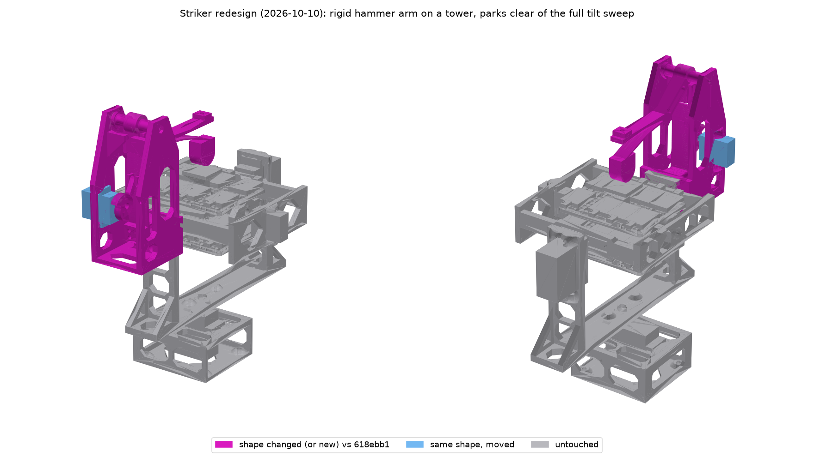

# IMU gimbal rig

Pan / tilt / roll rig that carries a whole set of Adafruit IMU, accelerometer
and magnetometer breakouts (3/6/9 DoF) at once, with a cam-driven striker for
tap and double-tap detection testing.

Target sensors: the drivers added in
[adafruit/Adafruit_Wippersnapper_Arduino#839](https://github.com/adafruit/Adafruit_Wippersnapper_Arduino/pull/839)
(ISM330DHCX, ISM330DLC, LIS2MDL, LIS3DH, LIS3MDL, LSM303AGR, LSM303DLH,
LSM6DS3, LSM6DSO32, LSM9DS1). Mostly STEMMA QT breakouts, the odd legacy board,
and one FeatherWing.

## Requirements

- Every sensor is mounted at the same time, on stacked layers of swirly-grid
  plates ([tannewt/swirly-grid](https://github.com/tannewt/swirly-grid)). The
  sides stay open, with a small roof in the middle of the top to whack on. A
  swirly-grid PCB also bolts on through the matching slots.
- Only the centre plate connects to the roll servo and axle. The other plates
  hang off it on central standoffs in line with the roof, not at the edges.
- STEMMA QT sized breakouts, 4 across, plus a Feather-sized place for one
  FeatherWing.
- Hobby servos: MG90S (roll, and an MG90S-size 270° servo for the striker
  cam) and DS3240MG (tilt and pan). Both are measured; see
  `docs/servo-measurements.png`.
- Aim for ±180° on every axis. In practice the servo travel limits it.
- Sensors do not need to sit on the rotation centre. Off-axis
  acceleration is accepted.

## Sensor stack (`make_sensor_stack.py`)

Each deck is a 5 x 4 cell swirly grid (76.2 x 61 mm) with a 3 mm border. The
sides are open.

| Deck | Boards |
|---|---|
| top | 8 portrait QT around a central post with a flared **roof** (24 mm square) for the striker |
| middle | FeatherWing on 10 mm standoffs (clears header pins) + 1 QT, and 4 QT. Its +X / -X end walls (6 mm, with a rib and boss behind the hub) carry the MG90S roll horn and the idler axle. This is the only deck connected to the gimbal. |
| bottom | 8 portrait QT |

That is room for **21 QT boards + 1 FeatherWing**. PR 839 needs 9 breakouts + the wing.

- **Board layout:** boards sit portrait, 4 across, in two rows per deck. Each
  uses the QT connector on its outer edge, so cables leave through the open
  ±Y sides.
- **Fixing:** each board bolts through its top-edge hole pair (every QT board
  has it), with M2.5 screws, 3 mm spacers and nuts.
- **Spines:** a solid strip runs between the two rows on every deck. The upper
  and lower spines (36 x 7 mm standoffs) sit on it, directly under the roof.
- **Clamping:** two M3 bolts at x = ±14 run through the whole stack, with the
  heads on top, just outside the roof, and nuts underneath. The top and bottom
  decks have bosses round the bolt holes (6 mm there instead of 3), so washers
  are optional.
- **Mux:** you'll need a TCA9548A, because of I²C address clashes (several
  LIS3MDL/LSM303/LSM9DS1 parts share addresses). It fits in a spare board spot.

`pack_faces.py` checks the board placements against the slot geometry.

## Tap striker (`make_striker.py`)

**Redesigned 2026-10-10 so the gimbal can tilt all the way over.** The old
hairpin bar hovered just above the roof and limited tilt to ±55°. Now a rigid
hammer arm pivots on top of a tower on the pan yoke. When parked, it swings
up and well clear of the whole tilt sweep.




**Parts:**
- **Tower** (`striker_stand`): bolts to the yoke's idler upright with the
  same 4 x M3 as before. Everything on it stays behind the ring band
  (y < −62 mm), so nothing on it can meet the ring when it tilts.
- **Hammer arm** (`striker_arm`): pivots on an M3 x 50 bolt, through a printed
  bushing and two spacers, about 66 mm above the roof.
- **Drive leaf** (`striker_spring`): a PETG strip standing on a seat at the
  bottom of the tower. Its tip fork is pinned (M3) to the arm's tail.
- **Cam:** the 270° servo's two-lobe cam bends the drive leaf through a
  folding pawl.

**How it works:**
- **Rest:** the drive leaf pushes the tail back, and the tail lands on a
  rest stop between the walls (with a 2 mm bumper lip). The hammer head then
  hovers **5 mm above the roof**. The servo carries no load at rest:
  the pawl sits 0.4 mm clear of the cam's base circle.
- **Park:** the cam bends the leaf, which swings the arm **48° up**.
  The parked arm clears everything that moves through the full 360° of tilt.
- **Tap:** at a cliff the pawl drops off the cam. The leaf throws the arm
  down onto its rest stop, and the stop takes the arm's energy.
- **Let-off:** the head sits on its own thin PETG leaf (lost motion). A nylon
  M3 screw in the overarm presses the leaf down, preloading it **1.4 N**
  against the screw. When the arm stops, the head's momentum carries it on
  through the 5 mm gap to the roof (**2.0 N** of leaf force at
  contact). Then it springs back onto the screw. The preload keeps it from
  bouncing back into the roof for a second tap.
- **Energy:** the drop releases **54.7 mJ** in all.
  - **36 mJ** is the head's share. That's what the tap carries
    (**27.5 mJ** is left at the roof after the leaf work).
  - The arm's **18.7 mJ** goes into the tower's rest stop, not the
    sensor stack.
- **Let-off margin:** the head could travel **15.5 mm** past the arm
  stop if the roof weren't there. That's ≥ 3 x the 5 mm gap, so the tap
  always lands.
- **Pawl:** pinned with 1.75 mm filament. It points at the cam centre and
  leans 16° past the cam's force line onto a stop under it. The cam's push,
  its forward drag and gravity all hold it there. On the reverse stroke the
  cliffs fold it up and back, and gravity drops it back.
- **Two lobes in the 270° travel.** Forward is −X rotation (seen from +X,
  the cam turns clockwise). If your servo runs the other way, flip the
  angles in software.

  | Action | Servo |
  |---|---|
  | rest, hammer hovering | 0° |
  | park for a double tap | ~120° |
  | park for a single tap | ~240° |
  | double tap | sweep forward through 125° and 245° (about 0.2 s apart at full MG90S speed) |
  | single tap | from 240°, step past 245° |
  | re-arm | back to 0°, then forward to a park angle |

  **Keep the hammer parked whenever the gimbal moves.**

**Computed for E = 2 GPa** (spring models in `leaf_design()` and
`head_leaf_design()`):

| | |
|---|---|
| drive leaf | 20 x 2.01 x 68 mm. 1.69 N at rest, 5.13 N parked at the pin; 1.3 % peak strain parked. The seat leans back 5.57° so a straight print is preloaded |
| head leaf | 12 x 1.36 x 50 mm, k = 0.12 N/mm, preloaded 11.7 mm by the stop screw; 1.36 % strain at contact |
| arm | 20.2 g; the head is 0.66 of its moment of inertia |
| cam | lift 5.72 mm (r 8 → 13.7). 14.5 N on the pawl when parked (the old bar: 14 N); servo torque ≤ 0.48 kg·cm |

**Clearance** (`striker_limits()` in `make_gimbal.py`: `distToShape`
against everything that moves, 5° steps). Each limit is ≥ 5 mm.

| | tilt 360° (parked) | roll ±90° (parked) | tilt 360° x roll ±45/±90° (parked, 15° steps) | at rest, tilt 0 / roll 0 |
|---|---|---|---|---|
| main | **7.9 mm** (clear through 360°) | 17.9 mm | 7.9 mm | 5.0 mm (the head over the roof) |
| `tall_top` | **7.9 mm** (clear through 360°) | 16.3 mm | 7.9 mm | 5.0 mm (the head over the roof) |

The ring's −Y axle stub is left out of these checks. It only spins inside the yoke's bearing, and its 4.5 mm to the tower's axle-screw pocket is set by the yoke (unchanged).

**At rest, apart from the roof** (main and `tall_top` alike), the nearest
moving part to each striker piece is:
- head: a top-deck QT board, 17.0 mm
- head leaf: 42.0 mm
- arm: 47.6 mm

The rest of the striker is at least 7.9 mm from anything that moves.

**Tuning:**
- The tap energy, contact force, gap and let-off margin are `TAP_ENERGY`,
  `F_CONTACT`, `HOVER` and `OVERSHOOT_MIN` at the top of `make_striker.py`.
  The leaves are re-solved from those values.
- On the bench, the stop-screw nuts trim the head preload. A thin shim on
  the rest-stop lip trims the hover gap.
- **Creep:** PETG relaxes under constant load. The drive leaf only carries
  much load while parked, and the stop screw takes up any creep in the head
  leaf.

**Printing:**
- `striker_arm` and `striker_spring` must be PETG, at 100 % infill.
  - `striker_arm` prints on its side (one 12 mm thick profile).
  - `striker_spring` prints flat, with its lugs and fork up.
- The tower prints upright, floor down. The pivot bosses are downward
  teardrops, and the walls stand vertical.

## Gimbal (`make_gimbal.py`)

Axes: roll = X, tilt = Y, pan = Z, all crossing in the stack. The script
measures the sweep radius of each stage to size the next one out. It then
rotates each stage through 360° against its neighbour, checks the striker
against the roll and tilt ranges, and reports any collision.

| Part | Holds | Servo | Idler |
|---|---|---|---|
| `stack_*` | all the boards | MG90S horn pocket on the middle deck's +X wall | M3 axle boss on the -X wall |
| `tilt_ring_mg90s` | roll servo + 623 bearing | MG90S (measured) | DS3240 horn on the +Y bar, M3 axle on -Y |
| `pan_yoke` | tilt servo + 623 bearing, outer gussets, striker stand pilots | DS3240MG on +Y | pan horn pocket underneath |
| `base` | pan servo | DS3240MG (270° version for ±135°) | open +X end for cables, 4 x M3 bench holes |
| `striker_*` | tower (stand), hammer arm, drive leaf, pawl, cam, pivot bushing + spacers | MG90S-size 270° servo | M3 pivot on a printed bushing |

**Servo mounts:** each mount sets its height from G (tab top to spline top),
taken as you measured it: MG90S 12.0, DS3240 14.0. If a servo sits a little
low, put a washer under its tabs. Every mount has a wire notch at the spline
end, 0.4 mm clearance, lead-in chamfers on both faces and bosses round the
screw pilots; see [Fit fixes](#fit-fixes-after-the-first-test-print).

The overall envelope is about 137 x 226 x 249 mm with the striker at rest
(about 300 mm tall with the hammer parked), and the printed parts weigh
about 376 g solid (305 g with the old striker, 349 g before the fit fixes).

### Fixings

Lengths come from the plate thicknesses in the model. Self-tap means a
machine or self-tapping screw cut straight into the printed pilot hole.

**Near the sensors, use non-magnetic fixings** (nylon, brass, or at least A2
stainless). Steel within a few cm of a magnetometer shows up as hard- and
soft-iron error.

| Where | Fixing | Qty | Notes |
|---|---|---|---|
| **Sensor stack** | M3 x 50 bolt (tall_top: M3 x 55) | 2 | top deck through both spines to the bottom deck at x = ±14; grip 44.3 mm (tall_top 52.2); **brass or nylon preferred** |
| | M3 nut (+ washers, optional) | 2 | nuts under the bottom deck's bosses, heads on the top deck's bosses just outside the roof. With tall_top's M3 x 55, leave the washers out |
| **QT boards** | M2.5 x 10 screw + nut + 3 mm spacer | 2 per board | top-edge hole pair; **nylon**. 9 boards in PR 839 = 18 sets (capacity 21 boards = 42) |
| **FeatherWing** | M2.5 x 10 standoff (F-F) + 2 x M2.5 x 6 screws + nut | 4 | nylon; 10 mm clears male headers |
| **Roll axis** | MG90S horn: supplied centre screw + 2 x M2 x 6 self-tap (arm) | 1 set | middle deck +X wall (4 mm behind the pocket floor) |
| | 623ZZ bearing + M3 x 12 button head + washer | 1 | tilt ring -X end, screw into the middle deck's -X axle boss |
| | MG90S tab screws: supplied, or 2 x M2 x 8–10 self-tap | 2 | tilt ring servo plate (1.7 mm pilots, 10 mm deep in the bosses) |
| **Tilt axis** | DS3240 horn: supplied centre screw + 2 x M2.5 x 8 self-tap (arm) | 1 set | tilt ring +Y bar |
| | 623ZZ bearing + M3 x 12 button head + washer | 1 | yoke -Y upright, screw into the ring's -Y axle boss |
| | DS3240 tab screws: supplied, or 4 x M2.6/M3 x 10–14 self-tap | 4 | yoke +Y plate (2.4 mm pilots, 12 mm deep in the bosses) |
| **Pan axis** | DS3240 horn: supplied centre screw + 2 x M2.5 x 8 self-tap (arm) | 1 set | yoke underside |
| | DS3240 tab screws: supplied, or 4 x M2.6/M3 x 10–12 self-tap | 4 | base plate (10 mm deep in the bosses) |
| | M3 x 16 (or #4 wood) screws, bench | 4 | base foot corners (3.5 mm holes through 6 mm bosses) |
| **Striker** | M3 x 14 (x 16 at most, with a washer) | 4 | tower to the yoke's idler upright (covers the tilt bearing), as before. Plate 10 mm at the bosses + upright 6.4 mm; longer pokes through toward the tilt ring. Reach the heads through the 7 mm holes in the leaf seat |
| | M3 x 50 + M3 nut | 1 | arm pivot: −X wall, `striker_bushing` (the arm and 2 spacers ride on it), +X wall. The nut drops into the hex pocket on the +X wall; tighten until snug, since the bolt clamps the walls onto the bushing, not the arm |
| | M3 x 20 | 1 | drive pin: through the drive leaf's fork slots, self-tapped into the arm's tail (2.8 mm pilot). Leave the head ~0.3 mm off the fork so the pin slides |
| | M3 x 16 | 4 | drive leaf root pad to the seat (self-tap into the 2.8 mm pilots) |
| | **M3 x 30 nylon** + 2 nylon M3 nuts | 1 | head stop screw: down through the overarm, one nut under the boss and one on top. The lower nut sets how far the screw presses the head leaf (11.7 mm preload). **Nylon:** it hangs right over the top deck |
| | MG90S-size 270° servo tab screws: supplied, or 2 x M2 x 8 self-tap | 2 | the tower's −X wall (servo plate) |
| | `striker_cam`: supplied centre screw, horn trimmed to 14 mm and **CA-glued** into the cam | 1 | the cam has no arm pilots |
| | `striker_cam_spline` instead: M2 x 10 centre screw | 1 | counterbored from the cam's front face |
| | 1.75 mm filament, ~12 mm | 1 | pawl pin; melt or flare the ends |
| **Printed horns** (if used) | MG90S: M2 x 8 centre screw; DS3240: M3 x 10 centre screw | per horn | longer than stock, because the printed hub is thicker |

**Bearings:** 2 x 623ZZ (3 x 10 x 4 mm).

**To order:** see [docs/shopping_list.md](docs/shopping_list.md), with quantities rounded to pack sizes.

**Totals for the main design, with 9 QT boards + wing:**
- **M3:**
  - M3 x 50: 3 (2 stack bolts, 1 striker pivot)
  - M3 x 12: 2 (axles)
  - M3 x 14: 4 (striker tower)
  - M3 x 16: 4 (drive leaf pad)
  - M3 x 20: 1 (drive pin)
  - M3 x 30 nylon + 2 nylon nuts: 1 (head stop screw)
  - M3 nuts: 3 (stack bolts, pivot)
  - M3 washers: ~2 (axles; the stack washers are optional)
  - bench screws (M3 x 16): 4
- **M2.5:**
  - M2.5 x 10: 18 (QT boards)
  - M2.5 x 6: 8 (wing)
  - M2.5 x 8 self-tap: 4 (horn arms)
  - M2.5 nuts: 22
  - 3 mm spacers: 18
  - 10 mm F-F standoffs: 4
- **M2:**
  - M2 x 6 self-tap: 2 (MG90S horn arms)
  - M2 x 8 self-tap: 4 (MG90S tabs, if not supplied)
  - M3 x 12 self-tap: 8 (DS3240 tabs, if not supplied)
- **Servo-supplied:** the horn centre screws and tab screws for 2 x MG90S and
  2 x DS3240.
- **Other:** 2 x 623ZZ bearings and a little 1.75 mm filament.

**Horns: two options, one set of parts.** Every horn pocket works either way.

1. **Stock horn.** The pockets are sized for an assumed double-arm horn:
   - MG90S: 36 x 7 mm, 2 mm deep, hub 2.5 mm
   - DS3240: 46 x 8.5 mm, 2.5 mm deep, hub 3.5 mm

   Each pocket has self-tap pilots 3.5 mm in from the arm tips. If your horn's
   holes land elsewhere, drill your own.
2. **Printed horn.** Print `horn_mg90s_printed` (21T) or `horn_ds3240_printed`
   (25T).
   - **Fit:** shaped to fill its pocket exactly, with a moulded spline socket,
     so it fits whatever the stock horns turn out to be.
   - **Screws:** an M2 (MG90S) or M3 (DS3240) screw through the hub into the
     spline, and M2 / M2.5 arm screws into the pocket pilots.
   - **Printing:** print arm-down, socket up, with fine layers (0.1–0.12 mm,
     a 0.25 mm nozzle if you have one).
   - **Fit tuning:** `SPLINE_CLEAR` in `make_gimbal.py` (0.1 mm radial)
     loosens or tightens the spline.

**The striker cam** has both versions too: `striker_cam` takes a stock horn
trimmed to 14 mm, and `striker_cam_spline` has the 21T socket moulded in
(M2 screw from the front, counterbored).

**Fitting a horn, either way:** screw the horn to the part, press it onto the
spline, then drive the centre screw through the part's access hole.

## Fit fixes after the first test print


The first print failed in three ways:
- the servos would not go into their plates
- the plates and the tilt ring snapped at the screw pilots when they were
  flexed to get the servos in
- the middle deck's +X (horn) wall snapped along its top edge

Every fix is parametric. The servo-plate values are at the top of
`make_gimbal.py`, and the wall values at the top of `make_sensor_stack.py`.

| Problem | Fix | Parameters |
|---|---|---|
| The cable exit caught on the plate | A wire notch at the spline end of every body cut-out, through the plate and its bosses | `wire_notch` in the `MG90S` / `DS3240` dicts, `MOUSE_EAR_MIN_ARC` |
| The cut-out was too tight | 0.4 mm clearance per side (was 0.25), plus a 1 mm x 45° lead-in chamfer on **both** faces | `SERVO_CUT_CLEAR`, `SERVO_LEADIN` |
| Plates snapped at the pilots | 45° cone bosses on the side away from the tabs double the material round every tab pilot (the seat doesn't move). Bosses were also added at the striker-stand bolts, the stack bolt holes, the bench holes and the yoke's horn-arm pilots | `BOSS_FACTOR`, `BOSS_WALL` |
| The horn wall snapped | The wall is 6 mm thick (4 mm behind the pocket floor, was 2), wider than the horn arm and carried 8 mm above the axis with 45° shoulders. It has a rib and boss behind the hub and a flared root. The pocket has 45° roofs and the access hole is a teardrop, so nothing bridges when it prints walls-up | `WALL_T`, `WALL_ABOVE`, `RIB_*`, `ROOT_FLARE` |
| Thin bearing lips | Both 623 lips are 2.4 mm (were 2.0) | `RING_BRG_PLATE_T`, `YOKE_BRG_T` |
| Heavy parts | Windows in the low-stress webs of the ring, yoke, base and stand, with 45° tops so they print without support | `MAX_BRIDGE` |

**Wire notches and open-sided (mouse-ear) pilots.** A screw pilot sits right
where the cable leaves each servo, so the notch opens one side of that pilot
instead of leaving a paper-thin wall. At least 240° of wall stays round each
opened pilot (measured at mid-wall), and each one sits in a boss twice the
plate thickness.

| Plate | Servo | Notch | Pilots opened into the notch |
|---|---|---|---|
| `tilt_ring_mg90s` (roll) | MG90S | 6.0 mm wide, 1.1 mm past the cut-out (1.5 mm past the body end) | the one spline-end pilot (it's on the centreline) |
| `striker_stand` (cam) | MG90S | same | same |
| `pan_yoke` (tilt) | DS3240 | 8.0 mm wide, out to the tab end (7 mm past the body) | both spline-end pilots, inner side |
| `base` (pan) | DS3240 | same | same |

The MG90S notch is short because the spline-end screw sits on the centreline,
only ~1 mm past the body. If the cable still catches, there are two options:
- put the servo in from the other face (both faces are chamfered)
- lower `MOUSE_EAR_MIN_ARC` and give `wire_notch` a depth in mm. The build
  refuses a notch that opens a pilot past the limit.

**Which face each servo goes in from.** Turn each servo so the spline end (the
cable end) lines up with the notch.

| Servo | Plate | Goes in from | |
|---|---|---|---|
| roll MG90S | tilt ring, +X plate | inside the ring (the tab face), bottom first | the outer face also works (chamfered) |
| tilt DS3240 | yoke, +Y upright | the inner face (toward the ring), bottom first | tab face only |
| pan DS3240 | base, top plate | from above, bottom first | tab face only |
| cam MG90S | striker tower, −X wall | from inside the tower (the tab face), bottom first, before the leaf and cam go in; spline end (cable) up | the other face also works (chamfered) |

**Volume**, for the parts that were lightened or thickened:

| Part | Before (cm³) | After (cm³) | Change |
|---|---|---|---|
| `tilt_ring_mg90s` | 49.2 | 40.7 | −17 % |
| `pan_yoke` | 74.7 | 64.5 | −14 % |
| `base` | 54.9 | 36.0 | −34 % |
| `striker_stand` | 27.2 | 24.2 | −11 % |
| **those four** | **206.0** | **165.4** | **−20 %** |
| `stack_middle_deck` | 21.3 | 27.7 | +30 % (stronger walls) |
| `stack_top_deck` / `stack_bottom_deck` | 16.4 / 11.8 | 16.6 / 12.1 | bolt bosses |

**Envelope:** each middle-deck wall is 2 mm thicker. That makes the ring 4 mm
longer, puts the roll servo 2 mm further out and drops the yoke floor 2 mm.
The rig is now about 137 x 236 x 194 mm (was 132 x 236 x 192). The tilt range
with the striker fitted is unchanged.

**Not changed:**
- The tilt ring still needs supports: it's a closed frame, and its bars float
  above the bed.
- The tilt ring's DS3240 horn-arm pilots keep 3.5 mm behind the pocket floor.
  There's no room to thicken them: the horn is on the outside and the roll
  sweep margin is on the inside.
- The striker-stand pilots in the yoke's idler upright stay at the upright's
  6.4 mm. Only 1.5 mm separates it from the ring, so the stand side got the
  bosses instead.

## Print list


All the STLs are in `parts/`. PETG is recommended throughout because it takes
the taps well. **The striker arm and drive leaf must be PETG.**

| STL | Qty | Nozzle | Orientation on the bed | Notes |
|---|---|---|---|---|
| `stack_bottom_deck` | 1 | 0.4 preferred | flat, **bolt bosses up** (upside down) | slots must pass M2.5; on 0.6, regenerate with `SWIRLY_SLOT=2.95` |
| `stack_middle_deck` | 1 | 0.4 preferred | flat, end walls up | carries the roll horn and axle. The horn pocket has 45° roofs and the access hole is a teardrop, so no supports; slot note as above |
| `stack_top_deck` | 1 | 0.4 preferred | flat, roof up | the roof flare is 45°, so no supports; slot note as above |
| `stack_spine_lower` | 1 | 0.6 | on its 36 x 7 face | **11.1 mm** tall (bottom ↔ middle deck) |
| `stack_spine_upper` | 1 | 0.6 | on its 36 x 7 face | **17.1 mm** tall (middle ↔ top deck); 25 mm in `variants/tall_top` |
| `tilt_ring_mg90s` | 1 | 0.6 | flat | **still needs supports** under the side bars and bearing plate (they sit ~10–15 mm up; it's a closed frame). Windows, bosses and pocket roofs are all 45°. Drill the 1.7 mm servo pilots |
| `pan_yoke` | 1 | 0.6 | on its side (32 mm face down) | the U profile lies flat, so no supports; windows have 45° tops (either side down); ream the 623 pocket if tight |
| `base` | 1 | 0.6 | on its closed end wall | open box, no supports; windows have 45° tops |
| `striker_stand` | 1 | 0.6 | **upright, floor down** (as it sits on the yoke) | the tower: walls stand vertical, the pivot bosses are downward teardrops and the rest stops have 45° undersides, so no supports. Windows have 45° tops. Drill the small pilots |
| `striker_arm` | 1 | 0.4 preferred | **on its side** (the 12 mm thick profile flat) | **PETG**, 100 % infill. The head leaf is 1.36 mm thick (its stiffness goes as thickness cubed; the stop screw trims the preload) |
| `striker_spring` | 1 | 0.4 preferred | **flat on its plain (+Y) face**, lugs and fork up | **PETG**, 100 % infill. The drive leaf: its 2.01 mm thickness sets the drive force (thickness cubed) |
| `striker_bushing` | 1 | 0.4 | standing on end | 6 mm tube for the M3 pivot bolt |
| `striker_spacer` | 2 | 0.4 | standing on end | either side of the arm's hub |
| `striker_pawl` | 1 | **0.4 needed** | flat on a 4.4 mm face | 1.9 mm pin hole must swing freely; pin is 1.75 mm filament. **Reprint it:** it is 14 mm long now (was 9) |
| `striker_cam` | 1 | 0.4 preferred | flat, **horn pocket up** | takes a stock horn trimmed to 14 mm; a crisp cliff edge gives a clean drop |
| `striker_cam_spline` | (alt.) | **0.4 needed** | counterbored face down, hub up | 21T socket moulded in; use instead of `striker_cam` |
| `horn_mg90s_printed` | 0–1 | **0.4 needed** (0.25 better) | arm down, socket up | 0.3 mm deep spline teeth; only if the stock roll horn doesn't fit |
| `horn_ds3240_printed` | 0–2 | **0.4 needed** | arm down, socket up | only if the stock tilt/pan horns don't fit |

**Nozzle key:**
- **0.6:** resolution doesn't matter. Thicker lines make these stronger and
  faster; drill or ream the small holes.
- **0.4 preferred:** fits or force depend on accuracy. A 0.6 works with the
  adjustment noted.
- **0.4 needed:** fine features (splines, the pawl pin) that a 0.6 smears.

The core set is 15 parts (16 prints with the second spacer), plus the optional printed horns. Print the horns
with fine layers (0.1–0.12 mm). Print one horn first and test it on a servo
before printing the others (`SPLINE_CLEAR`).

**Spine names were swapped before 2026-10-10.** Older exports of
`stack_spine_lower` were really the 17.1 mm upper spine, and vice versa.
Check the height before using an older print.

## Assembly order

Centre every servo (power it at mid travel) before you fit its horn. Each
horn goes on the same way: screw the horn to the part, press it onto the
spline, then drive the centre screw through the part's access hole.

1. **Test-fit each servo in its plate** before anything else. Put it in
   bottom first, from the face in the table above, with the cable end at the
   notch. Drill the pilots if they're tight.
2. **Base:** drop the pan DS3240 into the base from above. The cable leaves
   through the open +X end. Fit the 4 tab screws, then screw the base to the
   bench.
3. **Yoke:**
   - Put the tilt DS3240 into the +Y upright from the inside (bottom first,
     outward). Fit its 4 tab screws.
   - Press a 623 into the -Y upright from the outside.
   - Screw the pan horn into the underside pocket and press it onto the pan
     spline. Drive its centre screw down through the floor's access hole now,
     while nothing is above it.
4. **Tilt ring:**
   - Put the roll MG90S into the +X plate from inside the ring. Fit its 2 tab
     screws.
   - Press a 623 into the -X bearing plate from the outside.
   - Screw the tilt horn into the +Y bar's pocket.
5. **Sensor stack:**
   - Fit the boards to the decks.
   - Stack the decks: bottom deck (bosses down), lower spine, middle deck,
     upper spine, top deck (bosses up). Clamp them with the two M3 bolts.
   - Screw the roll horn to the middle deck's +X wall.
6. **Stack into the ring:**
   - Press the roll horn onto the MG90S spline and fit its centre screw
     through the wall's access hole.
   - At the -X end, fit an M3 x 12 + washer through the ring's 623 into the
     middle deck's axle boss.
7. **Ring into the yoke:**
   - Press the tilt horn onto the tilt spline and fit its centre screw through
     the bar's access hole.
   - At -Y, fit an M3 x 12 + washer through the yoke's 623 into the ring's
     axle boss.
8. **Striker** (everything goes into the tower before it goes onto the yoke):
   - Put the cam MG90S into the tower's −X wall from inside, bottom first,
     spline end (cable) up. Fit its 2 tab screws.
   - Pin the pawl to the drive leaf's lugs with filament. It should swing
     freely and fall back onto its stop.
   - Screw the drive leaf's root pad to the seat (4 x M3 x 16), lugs and
     pawl toward the servo.
   - Put the bushing through the arm's hub, with a spacer either side. Hold
     the arm between the walls and push the M3 x 50 through the −X wall,
     the bushing and the +X wall, into the nut in its pocket. Tighten until
     snug. The arm should swing freely.
   - Bend the leaf's fork onto the tail (the leaf leans back about 5.5° when
     free). Drive the M3 x 20 pin through one fork slot, self-tap it through
     the tail and out through the other slot. Leave the head ~0.3 mm clear,
     so the pin can slide.
   - Fit the nylon stop screw down through the overarm with a nut under the
     boss. Turn it until the head leaf is pressed down 11.7 mm (the head's
     face is level), then lock it with the top nut.
   - Fit the cam with the servo at 0°: the pawl tip just clears the base
     circle, 45° up from the cam's +Y side.
   - Bolt the tower to the yoke's -Y upright (4 x M3 x 14, reached through
     the holes in the leaf seat). This covers the tilt axle screw, so fit the
     tower last.
   - Check the hover gap: the head's face should sit 5 mm above the roof. To
     trim it, shim the rest-stop lip, where the tail lands.

## Variants

| Folder | What's different |
|---|---|
| [`variants/tall_top`](variants/tall_top/README.md) | Upper spine 25 mm. The top deck, roof and striker sit 7.9 mm higher. Only `stack_spine_upper` and `striker_stand` are new prints. |

## Files

| File | What |
| --- | --- |
| `swirly_grid.py` | Pure-Python swirly-grid geometry + hole-pattern fit checker (`python swirly_grid.py 2 4`) |
| `pack_faces.py` | Portrait QT board placement options on a swirly grid |
| `make_sensor_stack.py` | Sensor stack decks, spines, roof, board layout, reference board envelopes |
| `make_striker.py` | Striker: drive-leaf and head-leaf spring models, hammer arm (rest / parked / as printed), pawl, cam, tower |
| `make_gimbal.py` | Full gimbal + striker, per-part STEP/STL in `parts/`, clearance checks, `imu-gimbal-assembly.FCStd` |
| `make_swirly_plate.py` | Flat printable swirly plate (env `SWIRLY_ROWS`, `SWIRLY_COLS`, `SWIRLY_SLOT`) |
| `make_carrier.py` | Older standalone flat plate with Feather bosses (not used by the gimbal) |
| `preview_swirly.py` | Matplotlib 2D preview |
| `docs/mechanical_data.md` | Board hole/IC positions for the PR 839 sensors, Feather spec, servo dimensions |

Generate with FreeCAD 1.1 (`C:\dev\software\FreeCAD\bin\freecadcmd.exe`):

```
freecadcmd -c "exec(open('make_gimbal.py').read(), {'__file__': 'make_gimbal.py', '__name__': '__main__'})"
```

## Notes

- A 1.0" x 0.7" STEMMA QT board (holes 0.8" x 0.5" apart) cannot land all four
  screws in the swirly grid at once. Three holes fit in 32 placements on a
  3x3 grid, and two holes fit in hundreds. Plan on 2–3 screws per board.
- Slots print at 2.75 mm (nominal 2.54 mm) so M2.5 screws pass on FDM.
