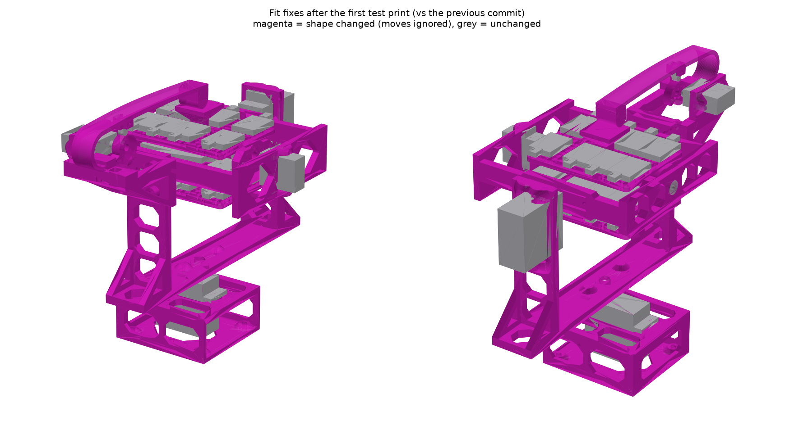
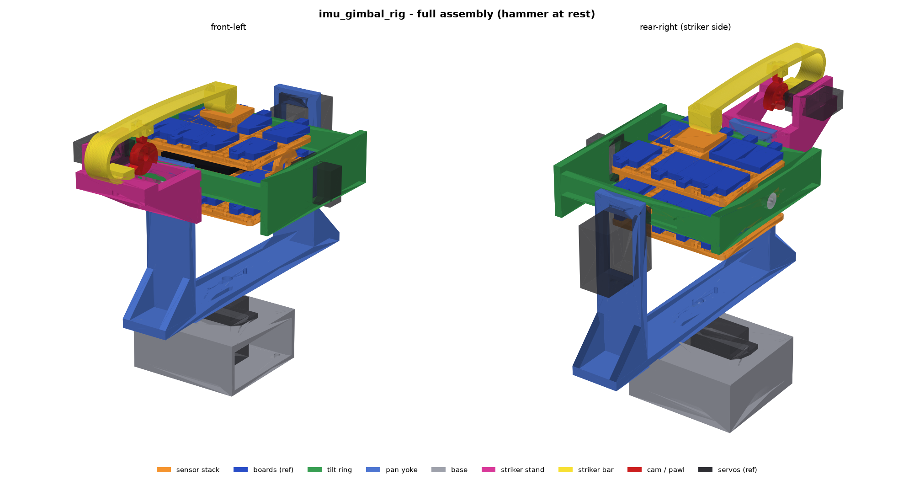

# IMU gimbal rig

Pan / tilt / roll rig that carries a whole set of Adafruit IMU, accelerometer
and magnetometer breakouts (3/6/9 DoF) at once, with a cam-driven striker for
tap and double-tap detection testing.

Target sensors: the drivers added in
[adafruit/Adafruit_Wippersnapper_Arduino#839](https://github.com/adafruit/Adafruit_Wippersnapper_Arduino/pull/839)
(ISM330DHCX, ISM330DLC, LIS2MDL, LIS3DH, LIS3MDL, LSM303AGR, LSM303DLH,
LSM6DS3, LSM6DSO32, LSM9DS1). Mostly STEMMA QT breakouts, the odd legacy board,
and one FeatherWing.

## Requirements

- Every sensor is mounted at the same time, on stacked layers of swirly-grid
  plates ([tannewt/swirly-grid](https://github.com/tannewt/swirly-grid)). The
  sides stay open, with a small roof in the middle of the top to whack on. A
  swirly-grid PCB also bolts on through the matching slots.
- Only the centre plate connects to the roll servo and axle. The other plates
  hang off it on central standoffs in line with the roof, not at the edges.
- STEMMA QT sized breakouts, 4 across, plus a Feather-sized place for one
  FeatherWing.
- Hobby servos: MG90S (roll, and an MG90S-size 270° servo for the striker
  cam) and DS3240MG (tilt and pan). Both are measured; see
  `docs/servo-measurements.png`.
- Aim for ±180° on every axis. In practice the servo travel limits it.
- Sensors do not need to sit on the rotation centre. Off-axis
  acceleration is accepted.

## Sensor stack (`make_sensor_stack.py`)

Each deck is a 5 x 4 cell swirly grid (76.2 x 61 mm) with a 3 mm border. The
sides are open.

| Deck | Boards |
|---|---|
| top | 8 portrait QT around a central post with a flared **roof** (24 mm square) for the striker |
| middle | FeatherWing on 10 mm standoffs (clears header pins) + 1 QT, and 4 QT. Its +X / -X end walls (6 mm, with a rib and boss behind the hub) carry the MG90S roll horn and the idler axle. This is the only deck connected to the gimbal. |
| bottom | 8 portrait QT |

That is room for **21 QT boards + 1 FeatherWing**. PR 839 needs 9 breakouts + the wing.

- **Board layout:** boards sit portrait, 4 across, in two rows per deck. Each
  uses the QT connector on its outer edge, so cables leave through the open
  ±Y sides.
- **Fixing:** each board bolts through its top-edge hole pair (every QT board
  has it), with M2.5 screws, 3 mm spacers and nuts.
- **Spines:** a solid strip runs between the two rows on every deck. The upper
  and lower spines (36 x 7 mm standoffs) sit on it, directly under the roof.
- **Clamping:** two M3 bolts at x = ±14 run through the whole stack, with the
  heads on top, just outside the roof, and nuts underneath. The top and bottom
  decks have bosses round the bolt holes (6 mm there instead of 3), so washers
  are optional.
- **Mux:** you'll need a TCA9548A, because of I²C address clashes (several
  LIS3MDL/LSM303/LSM9DS1 parts share addresses). It fits in a spare board spot.

`pack_faces.py` checks the board placements against the slot geometry.

## Tap striker (`make_striker.py`)

A PETG flat bar with a single hairpin curve at its base. A 270° servo lifts it
with a cam, and the bar drops onto the roof.

- **Preload is printed in.** The bar is printed in its free shape, with the
  hammer tip about 30 mm below the roof. Screw the pad down from under the
  stand (2 x M3). Without the cam, the hammer would press on the roof with
  **2 N**. Bend the bar up to fit the cam.
- **Hovers at rest:** the cam's base circle holds the pawl, so the hammer sits
  **~0.8 mm above the roof** (`HOVER` sets this), even with the servo
  unpowered. The cam carries about 10 N at rest. The pawl leans 8° into its
  stop, so that load holds it there.
- **Lift and release:** the cam lifts a pinned pawl under the bar. At the
  cliff, the pawl drops off and lands on the base circle. The hammer's
  momentum flexes the arm on through the hover gap into the roof, then it
  springs back to hover (piano-style let-off). The drop releases about 36 mJ.
  The arm could overshoot by about 14 mm, far more than the gap, so the tap
  always lands.
- **Reset:** a 270° servo has to turn back to re-arm. On the reverse stroke the
  pawl folds away from the cliffs, then gravity drops it back against its stop.
- **Two lobes in the 270° travel:**

  | Action | Servo |
  |---|---|
  | rest, hammer hovering | 0° |
  | park for a double tap | ~120° |
  | park for a single tap | ~240° |
  | double tap | sweep forward through 125° and 245°. The tap spacing is set by sweep speed: about 0.2 s at full MG90S speed, longer if you sweep slower. |
  | single tap | from 240°, step past 245° |
  | re-arm | back to 0°, then forward to a park angle |

  **Keep the hammer parked whenever the gimbal moves.**
- **Computed for E = 2 GPa:**
  - bar 16 x 3.0 mm, 116 mm reach, 12 mm hairpin
  - cam force 10 N at rest and 14 N when parked, cam lift 4.2 mm
  - servo torque about 0.35 kg·cm
  - peak strain 1.3 % when parked
- **Creep:** PETG relaxes under the constant rest load. The hover gap holds
  (the cam fixes the shape), but strike energy may fall a little over weeks.
- **Tuning:** force goes as thickness cubed. `BAR_T`, `F0` and `TRAVEL` are at
  the top of `make_striker.py`. A wedge shim under the pad also trims the
  preload.
- **Mounting:** the stand bolts to the outer face of the pan yoke's idler
  upright (4 x M3) and covers the tilt bearing.
- **Range with the striker fitted (hammer parked):** roll ±90° is clear, and
  tilt is limited to **±55°**.
- **Printing:** print `striker_bar` on its side, so the layers follow the bend.
  The pawl pin is a length of 1.75 mm filament.


## Gimbal (`make_gimbal.py`)

Axes: roll = X, tilt = Y, pan = Z, all crossing in the stack. The script
measures the sweep radius of each stage to size the next one out. It then
rotates each stage through 360° against its neighbour, checks the striker
against the roll and tilt ranges, and reports any collision.

| Part | Holds | Servo | Idler |
|---|---|---|---|
| `stack_*` | all the boards | MG90S horn pocket on the middle deck's +X wall | M3 axle boss on the -X wall |
| `tilt_ring_mg90s` | roll servo + 623 bearing | MG90S (measured) | DS3240 horn on the +Y bar, M3 axle on -Y |
| `pan_yoke` | tilt servo + 623 bearing, outer gussets, striker stand pilots | DS3240MG on +Y | pan horn pocket underneath |
| `base` | pan servo | DS3240MG (270° version for ±135°) | open +X end for cables, 4 x M3 bench holes |
| `striker_*` | bar, pawl, cam, stand | MG90S-size 270° servo | |

**Servo mounts:** each mount sets its height from G (tab top to spline top),
taken as you measured it: MG90S 12.0, DS3240 14.0. If a servo sits a little
low, put a washer under its tabs. Every mount has a wire notch at the spline
end, 0.4 mm clearance, lead-in chamfers on both faces and bosses round the
screw pilots; see [Fit fixes](#fit-fixes-after-the-first-test-print).

The overall envelope is about 137 x 236 x 194 mm (with the striker), and the
printed parts weigh about 305 g solid (349 g before the fit fixes).

### Fixings

Lengths come from the plate thicknesses in the model. Self-tap means a
machine or self-tapping screw cut straight into the printed pilot hole.

**Near the sensors, use non-magnetic fixings** (nylon, brass, or at least A2
stainless). Steel within a few cm of a magnetometer shows up as hard- and
soft-iron error.

| Where | Fixing | Qty | Notes |
|---|---|---|---|
| **Sensor stack** | M3 x 50 bolt (tall_top: M3 x 55) | 2 | top deck through both spines to the bottom deck at x = ±14; grip 44.3 mm (tall_top 52.2); **brass or nylon preferred** |
| | M3 nut (+ washers, optional) | 2 | nuts under the bottom deck's bosses, heads on the top deck's bosses just outside the roof. With tall_top's M3 x 55, leave the washers out |
| **QT boards** | M2.5 x 10 screw + nut + 3 mm spacer | 2 per board | top-edge hole pair; **nylon**. 9 boards in PR 839 = 18 sets (capacity 21 boards = 42) |
| **FeatherWing** | M2.5 x 10 standoff (F-F) + 2 x M2.5 x 6 screws + nut | 4 | nylon; 10 mm clears male headers |
| **Roll axis** | MG90S horn: supplied centre screw + 2 x M2 x 6 self-tap (arm) | 1 set | middle deck +X wall (4 mm behind the pocket floor) |
| | 623ZZ bearing + M3 x 12 button head + washer | 1 | tilt ring -X end, screw into the middle deck's -X axle boss |
| | MG90S tab screws: supplied, or 2 x M2 x 8–10 self-tap | 2 | tilt ring servo plate (1.7 mm pilots, 10 mm deep in the bosses) |
| **Tilt axis** | DS3240 horn: supplied centre screw + 2 x M2.5 x 8 self-tap (arm) | 1 set | tilt ring +Y bar |
| | 623ZZ bearing + M3 x 12 button head + washer | 1 | yoke -Y upright, screw into the ring's -Y axle boss |
| | DS3240 tab screws: supplied, or 4 x M2.6/M3 x 10–14 self-tap | 4 | yoke +Y plate (2.4 mm pilots, 12 mm deep in the bosses) |
| **Pan axis** | DS3240 horn: supplied centre screw + 2 x M2.5 x 8 self-tap (arm) | 1 set | yoke underside |
| | DS3240 tab screws: supplied, or 4 x M2.6/M3 x 10–12 self-tap | 4 | base plate (10 mm deep in the bosses) |
| | M3 x 16 (or #4 wood) screws, bench | 4 | base foot corners (3.5 mm holes through 6 mm bosses) |
| **Striker** | M3 x 14 (x 16 at most, with a washer) | 4 | stand to the yoke's idler upright (covers the tilt bearing). Stand 10 mm at the bosses + upright 6.4 mm; longer pokes through toward the tilt ring |
| | M3 x 14 from below (tall_top: M3 x 22) | 2 | through the pad seat into the bar's pad pilots |
| | MG90S-size 270° servo tab screws: supplied, or 2 x M2 x 8 self-tap | 2 | stand servo plate |
| | `striker_cam`: supplied centre screw, horn trimmed to 14 mm and **CA-glued** into the cam | 1 | the cam has no arm pilots |
| | `striker_cam_spline` instead: M2 x 10 centre screw | 1 | counterbored from the cam's front face |
| | 1.75 mm filament, ~12 mm | 1 | pawl pin; melt or flare the ends |
| **Printed horns** (if used) | MG90S: M2 x 8 centre screw; DS3240: M3 x 10 centre screw | per horn | longer than stock, because the printed hub is thicker |

**Bearings:** 2 x 623ZZ (3 x 10 x 4 mm).

**To order:** see [docs/shopping_list.md](docs/shopping_list.md), with quantities rounded to pack sizes.

**Totals for the main design, with 9 QT boards + wing:**
- **M3:**
  - M3 x 50: 2
  - M3 x 12: 2 (axles)
  - M3 x 14: 6 (4 stand, 2 pad)
  - M3 nuts: 2
  - M3 washers: ~2 (axles; the stack washers are optional)
  - bench screws (M3 x 16): 4
- **M2.5:**
  - M2.5 x 10: 18 (QT boards)
  - M2.5 x 6: 8 (wing)
  - M2.5 x 8 self-tap: 4 (horn arms)
  - M2.5 nuts: 22
  - 3 mm spacers: 18
  - 10 mm F-F standoffs: 4
- **M2:**
  - M2 x 6 self-tap: 2 (MG90S horn arms)
  - M2 x 8 self-tap: 4 (MG90S tabs, if not supplied)
  - M3 x 12 self-tap: 8 (DS3240 tabs, if not supplied)
- **Servo-supplied:** the horn centre screws and tab screws for 2 x MG90S and
  2 x DS3240.
- **Other:** 2 x 623ZZ bearings and a little 1.75 mm filament.

**Horns: two options, one set of parts.** Every horn pocket works either way.

1. **Stock horn.** The pockets are sized for an assumed double-arm horn:
   - MG90S: 36 x 7 mm, 2 mm deep, hub 2.5 mm
   - DS3240: 46 x 8.5 mm, 2.5 mm deep, hub 3.5 mm

   Each pocket has self-tap pilots 3.5 mm in from the arm tips. If your horn's
   holes land elsewhere, drill your own.
2. **Printed horn.** Print `horn_mg90s_printed` (21T) or `horn_ds3240_printed`
   (25T).
   - **Fit:** shaped to fill its pocket exactly, with a moulded spline socket,
     so it fits whatever the stock horns turn out to be.
   - **Screws:** an M2 (MG90S) or M3 (DS3240) screw through the hub into the
     spline, and M2 / M2.5 arm screws into the pocket pilots.
   - **Printing:** print arm-down, socket up, with fine layers (0.1–0.12 mm,
     a 0.25 mm nozzle if you have one).
   - **Fit tuning:** `SPLINE_CLEAR` in `make_gimbal.py` (0.1 mm radial)
     loosens or tightens the spline.

**The striker cam** has both versions too: `striker_cam` takes a stock horn
trimmed to 14 mm, and `striker_cam_spline` has the 21T socket moulded in
(M2 screw from the front, counterbored).

**Fitting a horn, either way:** screw the horn to the part, press it onto the
spline, then drive the centre screw through the part's access hole.

## Fit fixes after the first test print



The first print failed in three ways:
- the servos would not go into their plates
- the plates and the tilt ring snapped at the screw pilots when they were
  flexed to get the servos in
- the middle deck's +X (horn) wall snapped along its top edge

Every fix is parametric. The servo-plate values are at the top of
`make_gimbal.py`, and the wall values at the top of `make_sensor_stack.py`.

| Problem | Fix | Parameters |
|---|---|---|
| The cable exit caught on the plate | A wire notch at the spline end of every body cut-out, through the plate and its bosses | `wire_notch` in the `MG90S` / `DS3240` dicts, `MOUSE_EAR_MIN_ARC` |
| The cut-out was too tight | 0.4 mm clearance per side (was 0.25), plus a 1 mm x 45° lead-in chamfer on **both** faces | `SERVO_CUT_CLEAR`, `SERVO_LEADIN` |
| Plates snapped at the pilots | 45° cone bosses on the side away from the tabs double the material round every tab pilot (the seat doesn't move). Bosses were also added at the striker-stand bolts, the stack bolt holes, the bench holes and the yoke's horn-arm pilots | `BOSS_FACTOR`, `BOSS_WALL` |
| The horn wall snapped | The wall is 6 mm thick (4 mm behind the pocket floor, was 2), wider than the horn arm and carried 8 mm above the axis with 45° shoulders. It has a rib and boss behind the hub and a flared root. The pocket has 45° roofs and the access hole is a teardrop, so nothing bridges when it prints walls-up | `WALL_T`, `WALL_ABOVE`, `RIB_*`, `ROOT_FLARE` |
| Thin bearing lips | Both 623 lips are 2.4 mm (were 2.0) | `RING_BRG_PLATE_T`, `YOKE_BRG_T` |
| Heavy parts | Windows in the low-stress webs of the ring, yoke, base and stand, with 45° tops so they print without support | `MAX_BRIDGE` |

**Wire notches and open-sided (mouse-ear) pilots.** A screw pilot sits right
where the cable leaves each servo, so the notch opens one side of that pilot
instead of leaving a paper-thin wall. At least 240° of wall stays round each
opened pilot (measured at mid-wall), and each one sits in a boss twice the
plate thickness.

| Plate | Servo | Notch | Pilots opened into the notch |
|---|---|---|---|
| `tilt_ring_mg90s` (roll) | MG90S | 6.0 mm wide, 1.1 mm past the cut-out (1.5 mm past the body end) | the one spline-end pilot (it's on the centreline) |
| `striker_stand` (cam) | MG90S | same | same |
| `pan_yoke` (tilt) | DS3240 | 8.0 mm wide, out to the tab end (7 mm past the body) | both spline-end pilots, inner side |
| `base` (pan) | DS3240 | same | same |

The MG90S notch is short because the spline-end screw sits on the centreline,
only ~1 mm past the body. If the cable still catches, there are two options:
- put the servo in from the other face (both faces are chamfered)
- lower `MOUSE_EAR_MIN_ARC` and give `wire_notch` a depth in mm. The build
  refuses a notch that opens a pilot past the limit.

**Which face each servo goes in from.** Turn each servo so the spline end (the
cable end) lines up with the notch.

| Servo | Plate | Goes in from | |
|---|---|---|---|
| roll MG90S | tilt ring, +X plate | inside the ring (the tab face), bottom first | the outer face also works (chamfered) |
| tilt DS3240 | yoke, +Y upright | the inner face (toward the ring), bottom first | tab face only |
| pan DS3240 | base, top plate | from above, bottom first | tab face only |
| cam MG90S | striker stand plate | the cam side (the tab face), bottom first | the other face also works (chamfered) |

**Volume**, for the parts that were lightened or thickened:

| Part | Before (cm³) | After (cm³) | Change |
|---|---|---|---|
| `tilt_ring_mg90s` | 49.2 | 40.7 | −17 % |
| `pan_yoke` | 74.7 | 64.5 | −14 % |
| `base` | 54.9 | 36.0 | −34 % |
| `striker_stand` | 27.2 | 24.2 | −11 % |
| **those four** | **206.0** | **165.4** | **−20 %** |
| `stack_middle_deck` | 21.3 | 27.7 | +30 % (stronger walls) |
| `stack_top_deck` / `stack_bottom_deck` | 16.4 / 11.8 | 16.6 / 12.1 | bolt bosses |

**Envelope:** each middle-deck wall is 2 mm thicker. That makes the ring 4 mm
longer, puts the roll servo 2 mm further out and drops the yoke floor 2 mm.
The rig is now about 137 x 236 x 194 mm (was 132 x 236 x 192). The tilt range
with the striker fitted is unchanged.

**Not changed:**
- The tilt ring still needs supports: it's a closed frame, and its bars float
  above the bed.
- The tilt ring's DS3240 horn-arm pilots keep 3.5 mm behind the pocket floor.
  There's no room to thicken them: the horn is on the outside and the roll
  sweep margin is on the inside.
- The striker-stand pilots in the yoke's idler upright stay at the upright's
  6.4 mm. Only 1.5 mm separates it from the ring, so the stand side got the
  bosses instead.

## Print list



All the STLs are in `parts/`. PETG is recommended throughout because it takes
the taps well. **The striker bar must be PETG.**

| STL | Qty | Nozzle | Orientation on the bed | Notes |
|---|---|---|---|---|
| `stack_bottom_deck` | 1 | 0.4 preferred | flat, **bolt bosses up** (upside down) | slots must pass M2.5; on 0.6, regenerate with `SWIRLY_SLOT=2.95` |
| `stack_middle_deck` | 1 | 0.4 preferred | flat, end walls up | carries the roll horn and axle. The horn pocket has 45° roofs and the access hole is a teardrop, so no supports; slot note as above |
| `stack_top_deck` | 1 | 0.4 preferred | flat, roof up | the roof flare is 45°, so no supports; slot note as above |
| `stack_spine_lower` | 1 | 0.6 | on its 36 x 7 face | **11.1 mm** tall (bottom ↔ middle deck) |
| `stack_spine_upper` | 1 | 0.6 | on its 36 x 7 face | **17.1 mm** tall (middle ↔ top deck); 25 mm in `variants/tall_top` |
| `tilt_ring_mg90s` | 1 | 0.6 | flat | **still needs supports** under the side bars and bearing plate (they sit ~10–15 mm up; it's a closed frame). Windows, bosses and pocket roofs are all 45°. Drill the 1.7 mm servo pilots |
| `pan_yoke` | 1 | 0.6 | on its side (32 mm face down) | the U profile lies flat, so no supports; windows have 45° tops (either side down); ream the 623 pocket if tight |
| `base` | 1 | 0.6 | on its closed end wall | open box, no supports; windows have 45° tops |
| `striker_stand` | 1 | 0.6 | front plate (the face that bolts to the yoke) down | rails and webs stand vertical, web windows are triangles; drill the small pilots |
| `striker_bar` | 1 | 0.4 preferred | **on its side** (profile flat, 16 mm tall) | **PETG**, 100 % infill. Its 3.0 mm thickness sets the force (force goes as thickness cubed, so ±0.1 mm is about ±10 %) |
| `striker_pawl` | 1 | **0.4 needed** | flat on a 4.4 mm face | 1.9 mm pin hole must swing freely; pin is 1.75 mm filament |
| `striker_cam` | 1 | 0.4 preferred | flat, **horn pocket up** | takes a stock horn trimmed to 14 mm; a crisp cliff edge gives a clean drop |
| `striker_cam_spline` | (alt.) | **0.4 needed** | counterbored face down, hub up | 21T socket moulded in; use instead of `striker_cam` |
| `horn_mg90s_printed` | 0–1 | **0.4 needed** (0.25 better) | arm down, socket up | 0.3 mm deep spline teeth; only if the stock roll horn doesn't fit |
| `horn_ds3240_printed` | 0–2 | **0.4 needed** | arm down, socket up | only if the stock tilt/pan horns don't fit |

**Nozzle key:**
- **0.6:** resolution doesn't matter. Thicker lines make these stronger and
  faster; drill or ream the small holes.
- **0.4 preferred:** fits or force depend on accuracy. A 0.6 works with the
  adjustment noted.
- **0.4 needed:** fine features (splines, the pawl pin) that a 0.6 smears.

The core set is 12 parts, plus the optional printed horns. Print the horns
with fine layers (0.1–0.12 mm). Print one horn first and test it on a servo
before printing the others (`SPLINE_CLEAR`).

**Spine names were swapped before 2026-10-10.** Older exports of
`stack_spine_lower` were really the 17.1 mm upper spine, and vice versa.
Check the height before using an older print.

## Assembly order

Centre every servo (power it at mid travel) before you fit its horn. Each
horn goes on the same way: screw the horn to the part, press it onto the
spline, then drive the centre screw through the part's access hole.

1. **Test-fit each servo in its plate** before anything else. Put it in
   bottom first, from the face in the table above, with the cable end at the
   notch. Drill the pilots if they're tight.
2. **Base:** drop the pan DS3240 into the base from above. The cable leaves
   through the open +X end. Fit the 4 tab screws, then screw the base to the
   bench.
3. **Yoke:**
   - Put the tilt DS3240 into the +Y upright from the inside (bottom first,
     outward). Fit its 4 tab screws.
   - Press a 623 into the -Y upright from the outside.
   - Screw the pan horn into the underside pocket and press it onto the pan
     spline. Drive its centre screw down through the floor's access hole now,
     while nothing is above it.
4. **Tilt ring:**
   - Put the roll MG90S into the +X plate from inside the ring. Fit its 2 tab
     screws.
   - Press a 623 into the -X bearing plate from the outside.
   - Screw the tilt horn into the +Y bar's pocket.
5. **Sensor stack:**
   - Fit the boards to the decks.
   - Stack the decks: bottom deck (bosses down), lower spine, middle deck,
     upper spine, top deck (bosses up). Clamp them with the two M3 bolts.
   - Screw the roll horn to the middle deck's +X wall.
6. **Stack into the ring:**
   - Press the roll horn onto the MG90S spline and fit its centre screw
     through the wall's access hole.
   - At the -X end, fit an M3 x 12 + washer through the ring's 623 into the
     middle deck's axle boss.
7. **Ring into the yoke:**
   - Press the tilt horn onto the tilt spline and fit its centre screw through
     the bar's access hole.
   - At -Y, fit an M3 x 12 + washer through the yoke's 623 into the ring's
     axle boss.
8. **Striker:**
   - Put the cam MG90S into the stand from the cam side. Fit its 2 tab screws.
   - Screw the bar's pad down from under the seat (2 x M3).
   - Pin the pawl with filament.
   - Fit the cam with the servo at 0°.
   - Bolt the stand to the yoke's -Y upright (4 x M3 x 14). This covers the
     tilt axle screw, so fit the stand last.

## Variants

| Folder | What's different |
|---|---|
| [`variants/tall_top`](variants/tall_top/README.md) | Upper spine 25 mm. The top deck, roof and striker sit 7.9 mm higher. Only `stack_spine_upper` and `striker_stand` are new prints. |

## Files

| File | What |
| --- | --- |
| `swirly_grid.py` | Pure-Python swirly-grid geometry + hole-pattern fit checker (`python swirly_grid.py 2 4`) |
| `pack_faces.py` | Portrait QT board placement options on a swirly grid |
| `make_sensor_stack.py` | Sensor stack decks, spines, roof, board layout, reference board envelopes |
| `make_striker.py` | Striker bar spring model (free / installed / parked shapes), pawl, cam, stand |
| `make_gimbal.py` | Full gimbal + striker, per-part STEP/STL in `parts/`, clearance checks, `imu-gimbal-assembly.FCStd` |
| `make_swirly_plate.py` | Flat printable swirly plate (env `SWIRLY_ROWS`, `SWIRLY_COLS`, `SWIRLY_SLOT`) |
| `make_carrier.py` | Older standalone flat plate with Feather bosses (not used by the gimbal) |
| `preview_swirly.py` | Matplotlib 2D preview |
| `docs/mechanical_data.md` | Board hole/IC positions for the PR 839 sensors, Feather spec, servo dimensions |

Generate with FreeCAD 1.1 (`C:\dev\software\FreeCAD\bin\freecadcmd.exe`):

```
freecadcmd -c "exec(open('make_gimbal.py').read(), {'__file__': 'make_gimbal.py', '__name__': '__main__'})"
```

## Notes

- A 1.0" x 0.7" STEMMA QT board (holes 0.8" x 0.5" apart) cannot land all four
  screws in the swirly grid at once. Three holes fit in 32 placements on a
  3x3 grid, and two holes fit in hundreds. Plan on 2–3 screws per board.
- Slots print at 2.75 mm (nominal 2.54 mm) so M2.5 screws pass on FDM.
