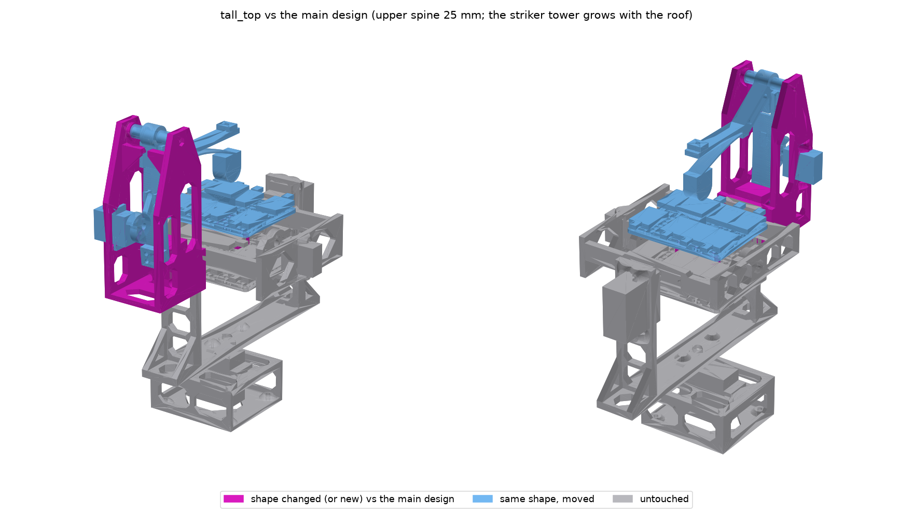

# Variant: tall_top

This is the main design with more room between the middle and top decks. The
upper spine goes from 17.1 mm to **25 mm**. The bottom deck and lower spine
are unchanged, since the bottom deck isn't attached to the gimbal.



## What changed

**Modified parts (print these):**

| Part | Change |
|---|---|
| `stack_spine_upper` | 17.1 → **25.0 mm** tall |
| `striker_stand` | the striker tower is 7.9 mm taller (overall 121.7 → 129.6 mm). Its walls, leaf seat and servo plate all move up with the roof |

**Same parts, sitting 7.9 mm higher:** `stack_top_deck` (and its roof), and
the whole striker mechanism: `striker_arm`, `striker_spring`,
`striker_pawl`, `striker_cam` / `striker_cam_spline`, `striker_bushing`,
`striker_spacer` and the cam servo. The STLs are the same as the main
design's.

**Unchanged:**
- The middle deck and its roll walls, the roll axis, tilt ring, pan yoke, base,
  bottom deck, lower spine and horns (all as in the main design, including the
  2026-10-10 fit fixes).
- The ring and yoke sizes are pinned to the main build (`../../build_info.json`).

**Striker numbers are the same as the main design** (2026-10-10 redesign;
see the main README):
- The head hovers 5 mm above the roof at rest.
- The arm parks 48° up.
- Tap energy is 36 mJ of 54.7 mJ total; the arm's 18.7 mJ lands on the
  tower's rest stop.
- Let-off overshoot is 15.5 mm.

**Clearance checks:**
- All checks pass.
- **Roll through 360°:** the higher top deck's connectors clear the unchanged
  tilt ring by 2.4 mm. The main design allows 4 mm, so allow less cable slack
  on the top deck if you roll it all the way round. Within the MG90S's ±90°
  there's more room.
- **Striker (parked):**
  - **tilt clear through 360°**, min distance 7.9 mm
  - roll ±90°: 16.3 mm
  - tilt x roll ±45/±90°: 7.9 mm
- **Striker at rest:** 5.0 mm (the head over the roof). Apart from the roof: head 17.0 mm to the nearest QT board, head leaf 42.0 mm, arm 47.6 mm.

**Hardware differences from the main fixings list:**
- **Stack bolts:** M3 x 55 instead of x 50. The grip is 52.2 mm with the deck
  bolt bosses, so leave the washers out (the bosses replace them).
- **Striker:** the same fixings as the main design. The old `tall_top` M3 x 22
  pad screws are no longer used.

## If you've already printed the main design

Print only `stack_spine_upper` and `striker_stand` from `parts/` here.
Everything else carries over.

## Regenerate

From the repo root, after a main build (which writes `build_info.json`):

```
GIMBAL_OUT=variants/tall_top GIMBAL_PIN=build_info.json STACK_UPPER_GAP=25 freecadcmd -c "exec(open('make_gimbal.py').read(), {'__file__': 'make_gimbal.py', '__name__': '__main__'})"
```
